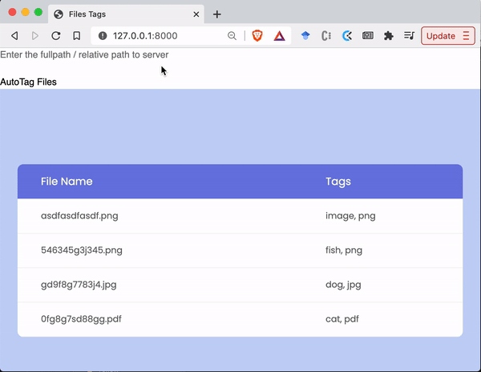

# doc_manager
Small prototype to **AutoTag** the files in any folder and sub folders. To run the server type in CLI:
```
uvicorn main:app --reload
```

This will open a server at `http://127.0.0.1:8000` and you can search in a specific folder at the input box on the type.



### Packages

Install packages using command:
```
pip3 install -r requirements.txt --user
```

### Training Code

Read `train.py` for better understanding of the training setup.

### Files

This is the description of the files:
- `assets/`: folder with things to run the webpage
- `sample/`: folder with sample PDFs for this prototype
- `classes.json`: file with labels
- `doc_manager.py`: code to process files
- `main.py`: server code
- `params.npy`: Classification Head paramters as a numpy array (np array is lighter than torch modules)
- `requirements.py`
- `train.py`: Sample code for training your own classifier head and save the `params.npy` file

